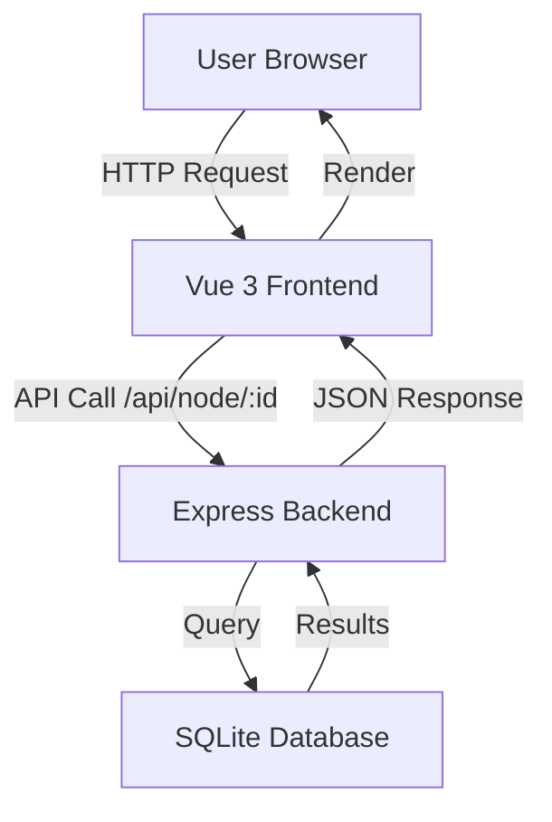
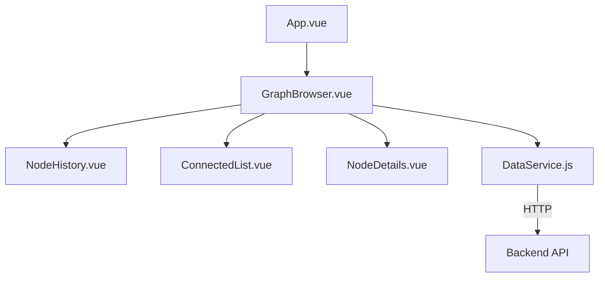

# Architecture Diagrams

This document contains visual representations of the Graph Browser architecture.

## System Architecture Diagram

```
┌─────────────────────────────────────────────────────────────────────────┐
│                         USER INTERFACE LAYER                            │
│                         (Web Browser - HTML/CSS/JS)                     │
└────────────────────────────────┬────────────────────────────────────────┘
                                 │
                                 │ HTTP/HTTPS
                                 │
┌────────────────────────────────▼────────────────────────────────────────┐
│                         FRONTEND APPLICATION                            │
│                         (Vue 3 SPA - Port 5173)                         │
│                                                                         │
│  ┌───────────────────────────────────────────────────────────────────┐ │
│  │                    App.vue (Root Component)                       │ │
│  │  ┌─────────────────────────────────────────────────────────────┐ │ │
│  │  │              GraphBrowser.vue (Main Container)              │ │ │
│  │  │                                                             │ │ │
│  │  │  ┌──────────────┐  ┌──────────────┐  ┌──────────────┐    │ │ │
│  │  │  │ NodeHistory  │  │ConnectedList │  │ NodeDetails  │    │ │ │
│  │  │  │   .vue       │  │   .vue       │  │    .vue      │    │ │ │
│  │  │  │              │  │ (Multiple    │  │              │    │ │ │
│  │  │  │ - Shows      │  │  instances)  │  │ - Shows node │    │ │ │
│  │  │  │   visited    │  │              │  │   metadata   │    │ │ │
│  │  │  │   nodes      │  │ - Shows root │  │ - Label, NS  │    │ │ │
│  │  │  │ - Click to   │  │   & children │  │ - Hash       │    │ │ │
│  │  │  │   navigate   │  │ - Emits      │  │ - Constituents│   │ │ │
│  │  │  │   back       │  │   selection  │  │              │    │ │ │
│  │  │  └──────────────┘  └──────────────┘  └──────────────┘    │ │ │
│  │  │                                                             │ │ │
│  │  │  State Management:                                         │ │ │
│  │  │  • selectedNode: Object                                    │ │ │
│  │  │  • connectedLists: Array[containerCount]                   │ │ │
│  │  │  • nodeHistory: Array                                      │ │ │
│  │  └─────────────────────────────────────────────────────────────┘ │ │
│  └───────────────────────────┬─────────────────────────────────────────┘ │
│                              │                                           │
│  ┌───────────────────────────▼─────────────────────────────────────────┐ │
│  │                  DataService.js (API Client)                        │ │
│  │                                                                     │ │
│  │  Methods:                                                           │ │
│  │  • getInitialNode(startingNode): Promise<Node>                    │ │
│  │  • childrenOf(nodeId): Promise<Node[]>                            │ │
│  │  • getNodeById(nodeId): Promise<Node>                             │ │
│  │                                                                     │ │
│  │  Uses: Axios HTTP Client                                           │ │
│  │  Base URL: /api                                                    │ │
│  └─────────────────────────────────────────────────────────────────────┘ │
└────────────────────────────────┬────────────────────────────────────────┘
                                 │
                                 │ HTTP REST API
                                 │ (Proxied by Vite in dev)
                                 │
┌────────────────────────────────▼────────────────────────────────────────┐
│                         BACKEND APPLICATION                             │
│                         (Express 5 - Port 3000)                         │
│                                                                         │
│  ┌─────────────────────────────────────────────────────────────────┐   │
│  │                  Middleware Stack                                │   │
│  │  ┌────────────────────────────────────────────────────────────┐ │   │
│  │  │  rateLimiter.js (express-rate-limit)                       │ │   │
│  │  │  • 100 requests per hour per IP                            │ │   │
│  │  │  • 60-minute rolling window                                │ │   │
│  │  └────────────────────────────────────────────────────────────┘ │   │
│  └─────────────────────────────────────────────────────────────────┘   │
│                                                                         │
│  ┌─────────────────────────────────────────────────────────────────┐   │
│  │                  API Routes (graph.js)                          │   │
│  │                                                                 │   │
│  │  GET /api/node/:id                                              │   │
│  │  ├─ Request: { params: { id: string } }                        │   │
│  │  ├─ Success: 200 { id, name, data }                            │   │
│  │  ├─ Not Found: 404 { error: "Node not found" }                 │   │
│  │  └─ Error: 500 { error: "Internal Server Error" }              │   │
│  │                                                                 │   │
│  │  GET /api/node/:id/children                                     │   │
│  │  ├─ Request: { params: { id: string } }                        │   │
│  │  ├─ Success: 200 [{ id, name, data }, ...]                     │   │
│  │  └─ Error: 500 { error: "Internal Server Error" }              │   │
│  └───────────────────────────┬─────────────────────────────────────┘   │
│                              │                                         │
│  ┌───────────────────────────▼─────────────────────────────────────┐   │
│  │              Database Abstraction (db.js)                       │   │
│  │                                                                 │   │
│  │  Exports:                                                       │   │
│  │  • getNode(id): Promise<Node>                                  │   │
│  │    └─ SELECT * FROM nodes WHERE id = ?                         │   │
│  │                                                                 │   │
│  │  • getChildren(id): Promise<Node[]>                            │   │
│  │    └─ SELECT * FROM nodes WHERE id IN                          │   │
│  │       (SELECT target FROM edges WHERE source = ?)              │   │
│  └───────────────────────────┬─────────────────────────────────────┘   │
└────────────────────────────────┼───────────────────────────────────────┘
                                 │
                                 │ SQLite3 API
                                 │
┌────────────────────────────────▼────────────────────────────────────────┐
│                         DATA LAYER                                      │
│                         (SQLite Database - File-based)                  │
│                                                                         │
│  ┌─────────────────────────────────────────────────────────────────┐   │
│  │  trains.db                                                       │   │
│  │                                                                 │   │
│  │  ┌────────────────────────────┐  ┌────────────────────────────┐ │   │
│  │  │     nodes TABLE            │  │     edges TABLE            │ │   │
│  │  │                            │  │                            │ │   │
│  │  │  • id (INTEGER PRIMARY KEY)│  │  • source (INTEGER FK)     │ │   │
│  │  │  • name (TEXT)             │  │  • target (INTEGER FK)     │ │   │
│  │  │  • data (TEXT/JSON)        │  │                            │ │   │
│  │  │    - label                 │  │  Relationships:            │ │   │
│  │  │    - NS (namespace)         │  │  • source → nodes(id)      │ │   │
│  │  │    - hash                  │  │  • target → nodes(id)      │ │   │
│  │  │    - constituents[]        │  │                            │ │   │
│  │  └────────────────────────────┘  └────────────────────────────┘ │   │
│  │                                                                 │   │
│  │  Created from: trains.sql                                       │   │
│  └─────────────────────────────────────────────────────────────────┘   │
└─────────────────────────────────────────────────────────────────────────┘
```

## Component Interaction Flow

```
┌──────────────┐
│     User     │
│  (Browser)   │
└──────┬───────┘
       │
       │ 1. Clicks node in ConnectedList
       │
       ▼
┌──────────────────────┐
│  ConnectedList.vue   │
│                      │
│  selectNode(nodeId)  │
└──────┬───────────────┘
       │
       │ 2. Emits 'node-selected' event
       │    with (nodeId, listIndex)
       │
       ▼
┌────────────────────────────────────────┐
│         GraphBrowser.vue               │
│                                        │
│  selectNode(nodeId, listIndex) {       │
│    1. Call DataService.getNodeById()   │
│    2. Call DataService.childrenOf()    │
│    3. Update connectedLists state      │
│    4. Update selectedNode state        │
│    5. Update nodeHistory state         │
│  }                                     │
└──────┬─────────────────────────────────┘
       │
       │ 3. API Request
       │
       ▼
┌────────────────────┐
│  DataService.js    │
│                    │
│  async getNodeById │
│  async childrenOf  │
└──────┬─────────────┘
       │
       │ 4. HTTP GET /api/node/:id
       │    HTTP GET /api/node/:id/children
       │
       ▼
┌────────────────────────────┐
│  Express Server            │
│  (graph.js)                │
│                            │
│  app.get('/api/node/:id')  │
└──────┬─────────────────────┘
       │
       │ 5. Database query
       │
       ▼
┌────────────────────┐
│     db.js          │
│                    │
│  getNode(id)       │
│  getChildren(id)   │
└──────┬─────────────┘
       │
       │ 6. SQL query
       │
       ▼
┌────────────────────┐
│  SQLite Database   │
│   (trains.db)      │
│                    │
│  SELECT ...        │
└──────┬─────────────┘
       │
       │ 7. Returns rows
       │
       ▼
┌────────────────────┐
│     db.js          │
│  Promise.resolve() │
└──────┬─────────────┘
       │
       │ 8. Returns JSON
       │
       ▼
┌────────────────────────────┐
│  Express Server            │
│  res.json(data)            │
└──────┬─────────────────────┘
       │
       │ 9. HTTP Response
       │
       ▼
┌────────────────────┐
│  DataService.js    │
│  response.data     │
└──────┬─────────────┘
       │
       │ 10. Return to component
       │
       ▼
┌────────────────────────────────────────┐
│         GraphBrowser.vue               │
│                                        │
│  Updates Vue reactive state            │
│  • selectedNode = node                 │
│  • connectedLists[i] = { root, children}│
│  • nodeHistory.push(node)              │
└──────┬─────────────────────────────────┘
       │
       │ 11. Vue reactivity triggers re-render
       │
       ▼
┌──────────────────────────┐
│  All child components    │
│  re-render with new data │
│                          │
│  • NodeHistory updates   │
│  • ConnectedList updates │
│  • NodeDetails updates   │
└──────┬───────────────────┘
       │
       │ 12. DOM updated
       │
       ▼
┌──────────────┐
│     User     │
│  sees update │
└──────────────┘
```

## State Management Flow

```
GraphBrowser State:
┌─────────────────────────────────────────┐
│  selectedNode: {                        │
│    id: 2,                               │
│    name: "Paris",                       │
│    data: { label, NS, hash, ... }      │
│  }                                      │
│                                         │
│  connectedLists: [                      │
│    {                                    │
│      root: { id: 1, name: "London" },  │
│      children: [                        │
│        { id: 2, name: "Paris" },       │
│        { id: 3, name: "Berlin" }       │
│      ]                                  │
│    },                                   │
│    {                                    │
│      root: { id: 2, name: "Paris" },   │
│      children: [...]                    │
│    },                                   │
│    { }  // empty list                   │
│  ]                                      │
│                                         │
│  nodeHistory: [                         │
│    { id: 1, name: "London" },          │
│    { id: 2, name: "Paris" }            │
│  ]                                      │
└─────────────────────────────────────────┘

When user clicks a node:
1. selectedNode ← new node
2. connectedLists[i+1] ← { root: new node, children: [...] }
3. connectedLists[i+2...end] ← {}
4. nodeHistory.push(new node)

Vue reactivity propagates changes:
NodeHistory ← nodeHistory
ConnectedList[i] ← connectedLists[i]
NodeDetails ← selectedNode
```

## Testing Architecture

```
┌─────────────────────────────────────────────────────────────┐
│                    Vitest Test Runner                        │
└───────────────────────┬─────────────────────────────────────┘
                        │
         ┌──────────────┴──────────────┐
         │                             │
         ▼                             ▼
┌────────────────────┐      ┌────────────────────┐
│  Frontend Tests    │      │  Backend Tests     │
│  (26 total)        │      │  (6 total)         │
└─────────┬──────────┘      └─────────┬──────────┘
          │                           │
          ▼                           ▼
┌───────────────────────┐    ┌──────────────────────┐
│ Component Tests       │    │ API Endpoint Tests   │
│                       │    │                      │
│ • ConnectedList (4)   │    │ • GET /node/:id (3)  │
│ • GraphBrowser (13)   │    │ • GET /node/:id/     │
│ • NodeDetails (2)     │    │   children (3)       │
│ • NodeHistory (1)     │    │                      │
└───────┬───────────────┘    └───────┬──────────────┘
        │                            │
        ▼                            ▼
┌────────────────────┐      ┌────────────────────┐
│  Test Utilities    │      │  Test Utilities    │
│                    │      │                    │
│ • @vue/test-utils  │      │ • supertest        │
│ • jsdom            │      │ • vi.mock()        │
│ • vi.mock()        │      │                    │
│ • graph.fixture    │      │ Mocks:             │
│                    │      │ • db.getNode()     │
│                    │      │ • db.getChildren() │
└────────────────────┘      └────────────────────┘
```

## Deployment Architecture

```
Development:
┌──────────────────────┐      ┌──────────────────────┐
│  Vite Dev Server     │      │  Node.js Server      │
│  Port 5173           │ ───► │  Port 3000           │
│                      │ proxy│                      │
│  • Hot Module Reload │      │  • Express routes    │
│  • API proxy         │      │  • SQLite database   │
└──────────────────────┘      └──────────────────────┘

Production (Static):
┌──────────────────────────────────────┐
│  Static Web Server (e.g., GitHub     │
│  Pages, Vercel, Netlify)             │
│                                      │
│  /graph-browser/                     │
│  ├── index.html                      │
│  ├── assets/                         │
│  │   ├── index.[hash].js             │
│  │   └── index.[hash].css            │
│  └── ...                             │
└──────────┬───────────────────────────┘
           │
           │ API calls to separate backend
           │
           ▼
┌──────────────────────────────────────┐
│  Node.js Server (deployed separately)│
│  Port 3000                           │
│                                      │
│  • Express routes                    │
│  • SQLite database                   │
│  • CORS enabled for frontend domain  │
└──────────────────────────────────────┘
```

## Directory Structure

```
graph-browser/
├── src/                          # Frontend source
│   ├── components/               # Vue components
│   │   ├── GraphBrowser.vue      # Main container
│   │   ├── ConnectedList.vue     # Node list display
│   │   ├── NodeDetails.vue       # Node information
│   │   ├── NodeHistory.vue       # Navigation history
│   │   ├── DataService.js        # API client
│   │   └── __tests__/            # Component tests
│   ├── assets/                   # Static assets
│   ├── App.vue                   # Root component
│   └── main.js                   # Entry point
│
├── api/                          # Backend source
│   ├── graph.js                  # Express server & routes
│   ├── db.js                     # Database layer
│   ├── rateLimiter.js            # Rate limiting middleware
│   ├── trains.db                 # SQLite database
│   ├── trains.sql                # Database schema
│   └── __tests__/                # API tests
│
├── documentation/                # Architecture docs
│   ├── SUMMARY.md                # This assessment summary
│   └── architecture/
│       ├── overview.md           # Technical overview
│       ├── diagrams.md           # Visual diagrams
│       └── decisions/            # ADRs
│           ├── README.md
│           ├── template.md
│           ├── 0001-use-vue3-for-frontend.md
│           ├── 0002-use-sqlite-for-data-storage.md
│           └── 0003-use-vitest-for-testing.md
│
├── ARCHITECTURE.md               # Comprehensive assessment
├── README.md                     # Project documentation
├── package.json                  # Dependencies & scripts
├── vite.config.js                # Vite configuration
├── vitest.config.js              # Test configuration
└── index.html                    # HTML entry point
```

---

**Note**: These diagrams use ASCII art for maximum compatibility. For production use, consider creating actual diagrams using tools like:
- Draw.io (diagrams.net)
- Lucidchart
- Mermaid (markdown-based)
- PlantUML
- Excalidraw

## Mermaid Diagram Examples

For GitHub/GitLab compatibility, here are some Mermaid versions:

### System Flow (Mermaid)



### Component Hierarchy (Mermaid)



---

**Last Updated**: 2025-10-10
